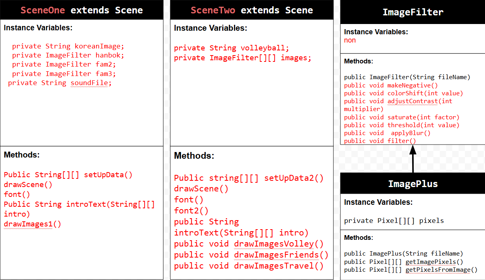
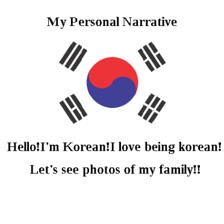

# Unit 5 - Personal Narrative / Interest Animation

## Introduction

Images are often used to portray our personal experiences and interests. We also use image filters and effects to change or enhance the mood of an image. When combined into collages and presentations, these images tell a story about who we are and what is important to us. Your goal is to create an animation using The Theater and Scene API that consists of images of your personal experiences and/or interests. In this animation, you will incorporate data related to these experiences and/or interests that can be organized in a 2D array, and use image filters and effects to change or enhance the mood of your images.

## Requirements

Use your knowledge of object-oriented programming, two-dimensional (2D) arrays, and algorithms to create your personal narrative collage or animation:
- **Write Scene subclasses** – Create two Scene subclasses: either two core parts of your personal life, or two components of a personal interest. Each class must contain a constructor and private instance variable with data related to the scene
- **Create at least two 2D arrays** – Create at least two 2D arrays to store the data that will make up your visualization.
Implement algorithms – Implement one or more algorithms that use loops and logic that operate on the data in your 2D arrays.
- **Create a visualization** – Create an animation that conveys the story of the data by illustrating the patterns or relationships in the data.
- **Image Filters** – Utilize the image filters created in this unit (and possible new filters) that show a personal flare to the images used in your animation.
- **Document your code** – Use comments to explain the purpose of the methods and code segments and note any preconditions and postconditions.

## UML Diagram

## Video

## Story Description

In my animation, I explored two aspects of my life; my family and my hobbies. First, I introduce myself, introducing myself as a Korean person and show pictures of my family. Then I shift to my hobbies, volleyball, traveling, and hanging out with friends. The data I stored in my 2D arrays are images and strings that I display in the first scene of both scenes. This relates by providing the images and the information that gives context.

## Image Filter Analysis

In my animation, I used many filters such as the blur filter, keepColor, and my custom made filter called filter. My custom filter, filter, randomizes the RBG values from 0 to 255 and sets that to teh new RBG values of the pixels. The blur filter takes the upper left pixel and sets it to the current pixesl to create a blurred appearence using the weighted RBG values. The keepColor filter sets the RBG values to 0 except the parameter given. All these work in my code.
